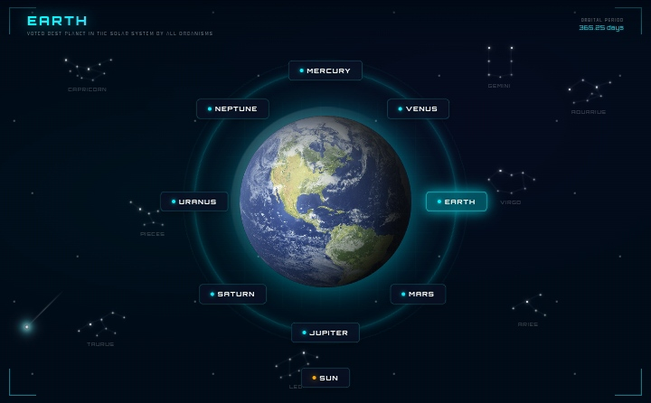
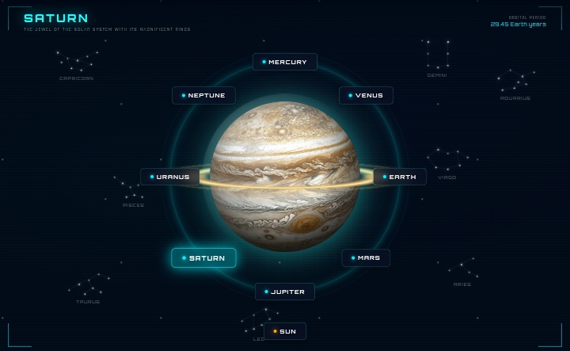
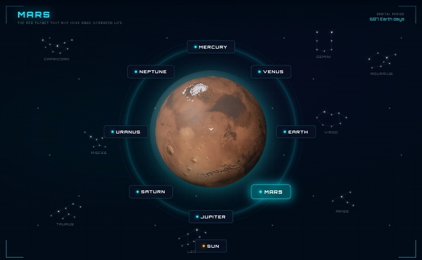
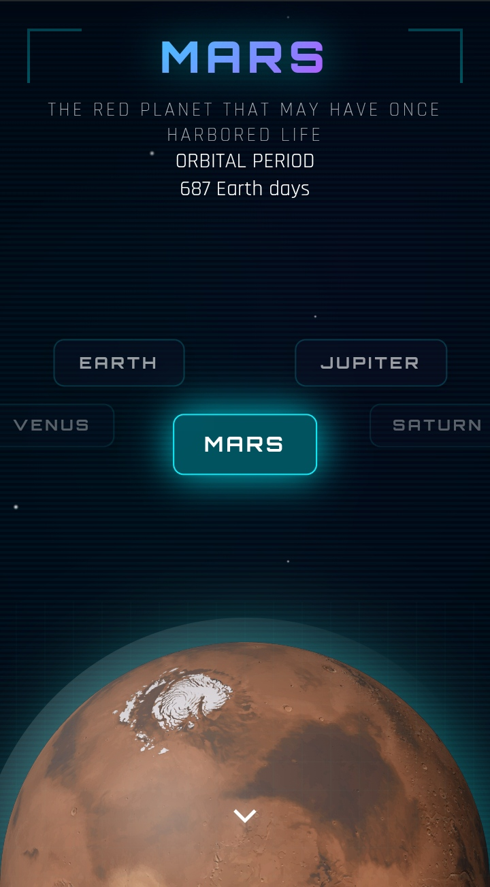
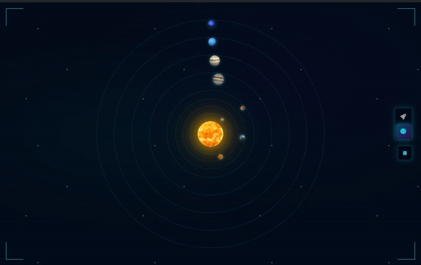

# 🌌 Solar System Explorer

Explore the planets of our Solar System with visuals and information. Built with pure HTML, CSS, and JavaScript.






## Solar System Simulator


## ✨ Features

- **Planet Navigation**: Click on any planet button to view information
- **Animations**: 
  - Animated star field with shooting stars
  - Smooth planet transitions
  - Glowing effects and holographic grids
- **Planet Data**: Each planet includes:
  - Orbital period and diameter
  - Mass and distance from the Sun
  - Temperature range
  - Number of moons
  - Axial tilt and gravity
  - Facts and overview
- **Special Saturn Rings**: Realistic 3D ring system with proper depth (top behind, bottom in front)
- **Sci-Fi Theme**: Futuristic UI with glowing cyan accents and scan lines

## 🪐 Planets Included

- ☀️ **Sun** - The star at the center of our Solar System
- ☿ **Mercury** - The smallest and fastest planet
- ♀ **Venus** - Earth's scorching twin
- 🌍 **Earth** - Our home planet
- ♂ **Mars** - The Red Planet
- ♃ **Jupiter** - The king of planets
- ♄ **Saturn** - The jewel with magnificent rings
- ⛢ **Uranus** - The sideways planet
- ♆ **Neptune** - The windiest planet

## 🎮 How to Use

1. **Navigate Between Planets**: Click on any planet button in the circular navigation
2. **View Details**: Click the downward arrow at the bottom to open the data panel
3. **Close Panel**: Click the X button or click anywhere outside the panel
4. **Explore**: Each planet has unique visuals, colors, and information

## 🎨 Technologies Used

- **HTML5** - Structure and content
- **CSS3** - Styling, animations, and 3D transformations
  - Custom CSS animations
  - Radial and linear gradients
  - CSS masks for Saturn's rings
  - Backdrop filters for glass effects
- **JavaScript (Vanilla)** - Interactive functionality and data management
- **Google Fonts** - Orbitron and Rajdhani fonts

## 📁 Project Structure

```
solar-system-explorer/
├── index.html          # Main HTML file
├── styles.css          # All CSS styles and animations
├── script.js           # JavaScript functionality
├── images/             # Planet images
│   ├── sun.png
│   ├── mercury.png
│   ├── venus.png
│   ├── earth.png
│   ├── mars.png
│   ├── jupiter.png
│   ├── saturn.png
│   ├── uranus.png
│   └── neptune.png
└── README.md          # This file
```

## 🔧 Customization

### Changing Colors
Edit the CSS variables in `styles.css`:
```css
:root {
    --primary-glow: #00f3ff;
    --secondary-glow: #ff00ff;
    --accent-cyan: #0ff;
    --accent-purple: #b300ff;
}
```

### Adding New Planets
1. Add planet data to `planetsData` object in `script.js`
2. Add planet image to `images/` folder
3. Add navigation button in `index.html`

## 📱 Browser Support

- Chrome/Edge (latest)
- Firefox (latest)
- Safari (latest)
- Opera (latest)

## 📄 License

This project is licensed under the MIT License - see the LICENSE [LICENSE](LICENSE) file for details.

## 🙏 Acknowledgments

- Planet data sourced from NASA and astronomical databases
- Font families from Google Fonts
- Inspired by sci-fi interfaces and space exploration

## 🌟 Future Enhancements

- Add dwarf planets (Pluto, Ceres, Eris)
- Include asteroid belt visualization
- Implement 3D planet models
- Add planetary moon information
- Include scale comparison tool

---

**Enjoy exploring our Solar System!** 🚀✨
